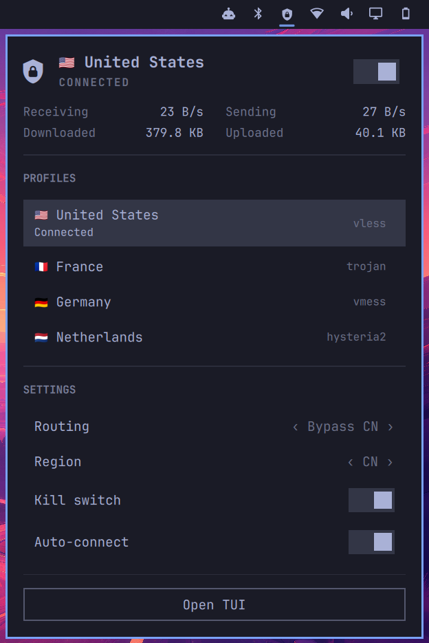

# omakvn

Native [Omarchy 4](https://omarchy.org/) Quickshell bar plugin for
[kvn-tui](https://github.com/yarikov/kvn-tui).

The widget shows the live VPN state and traffic, lets you connect or switch
profiles, and exposes routing mode, geo region, kill switch, and auto-connect
controls directly from the bar.



## Quick start

1. Follow the full [`kvn-tui` installation guide](https://github.com/yarikov/kvn-tui#installation-arch-linux),
   or install the AUR package and start its user service:

   ```bash
   yay -S kvn-tui-bin
   systemctl --user enable --now kvn-tui.service
   ```

2. Install and enable the widget:

   ```bash
   omarchy plugin add https://github.com/yarikov/omakvn.git --enable
   ```

3. Click the shield in the Omarchy bar and select a VPN profile.

No profiles yet? Open `kvn-tui`, press `p`, and paste a VPN share link or
subscription URL.

## Features

- Connect, disconnect, reconnect, and switch VPN profiles from the bar.
- See the active profile, connection state, live traffic rates, totals, and
  active connection count at a glance.
- Change geo region and routing mode without opening the full TUI.
- Toggle the kill switch and auto-connect settings.
- Open the complete `kvn-tui` interface when advanced controls are needed.

## Requirements

- Omarchy 4 with Shell plugin support
- [`kvn-tui`](https://github.com/yarikov/kvn-tui#installation-arch-linux)
  0.27.0 or newer, installed and available on `PATH`

## Install

```bash
omarchy plugin add https://github.com/yarikov/omakvn.git --enable
```

The plugin is placed in the right bar section by default. It can also be moved
after installation:

```bash
omarchy bar move yarikov.omakvn --section right
```

This command installs only the bar widget. Alternatively,
`kvn-tui setup --omarchy` installs and enables the widget and configures the
optional launcher keybinding and floating-window rule.

## Usage

- Left click opens the control panel.
- Right click connects the last-used profile or disconnects the active tunnel.
- Middle click opens the full TUI.

| Key | Action |
|---|---|
| `j` / `k`, up/down | Move between controls |
| `g` / `G` | Jump to the first or last control |
| `Enter` / `Space` | Activate the selected control |
| `h` / `l`, left/right | Change the selected routing mode or region |
| `s` | Disconnect |
| `r` | Reconnect |
| `a` | Toggle auto-connect |
| `K` | Toggle the kill switch |
| `t` | Open the full TUI |
| `Tab` / `Shift+Tab` | Switch between bar panels |
| `Escape` | Close the panel |

The plugin communicates with the `kvn-tui` daemon over its user-only Unix
socket. It does not implement VPN protocols or manage the tunnel itself.

## Troubleshooting

### The daemon is not running

Click **Start daemon** in the widget or start and enable the service manually:

```bash
systemctl --user enable --now kvn-tui.service
```

Run the built-in read-only diagnostics if it does not start:

```bash
kvn-tui doctor
```

### No profiles are shown

Open `kvn-tui` and press `p` to import a VPN share link or subscription URL.

### The widget is installed but missing from the bar

Add it to the right section and ask the shell to rescan installed plugins:

```bash
omarchy bar put yarikov.omakvn --section right
omarchy-shell shell rescanPlugins
```

## Update

```bash
omarchy plugin update yarikov.omakvn
```

## Remove

```bash
omarchy plugin remove yarikov.omakvn
```

## Development

Validate the repository before publishing changes:

```bash
omarchy plugin validate .
```

For local testing, install the working tree manually under
`~/.config/omarchy/plugins/yarikov.omakvn/`, rescan plugins, and enable it:

```bash
omarchy-shell shell rescanPlugins
omarchy plugin enable yarikov.omakvn
```

## Credits

The original Omarchy 4 integration was contributed by
[Denis Chupritskiy](https://github.com/chupre).

## License

[MIT](LICENSE)
